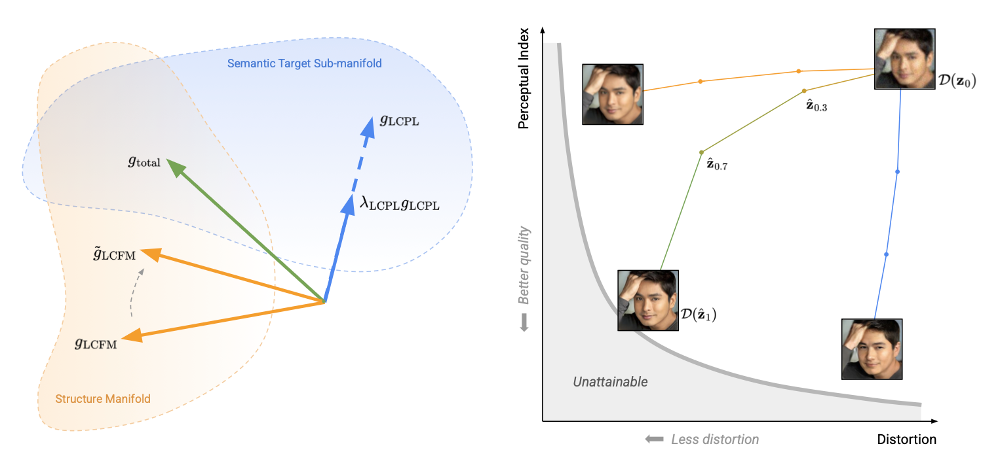

# Flow Straight to Reality: Perceptually Consistent Flow Matching for Efficient Image Restoration

<div align="center">
  
</div>

> **Abstract.** Image restoration is fundamentally constrained by the tradeoff between distortion and perception: minimizing pixel-wise error yields over-smoothed results, whereas optimizing for perceptual realism often introduces structural deviations. Recent approaches attempt to balance this tradeoff via posterior sampling or multi-stage generative pipelines, yet remain computationally expensive and architecturally complex. To overcome these limitations, we propose PCFlow (Perceptually Consistent Flow Matching), a unified framework that directly parameterizes a continuous transport from degraded observations to clean targets, jointly optimizing distortion and perceptual quality. While its latent consistency flow objective drives stable and efficient few-step inference, a Latent Consistency Perceptual Loss (LCPL) imposes semantic constraints directly on the guiding velocity field, steering the dynamics toward visually sharp data manifolds. Furthermore, recognizing the inherent conflict between structural and perceptual consistencies, we integrate a conflict-free gradient projection strategy to stabilize the multi-objective optimization landscape. Combined with lightweight, convolution-only backbone, PCFlow achieves competitive performance across diverse restoration tasks at a fraction of traditional computational costs.


## Table of Contents

1. [Environment setup](#environment-setup)
2. [Datasets](#datasets)
3. [Training](#training)
4. [Inference](#inference)
6. [Acknowledgments](#acknowledgments)


## Environment setup

```bash
# create conda environment
conda create -n pcflow python=3.10
conda activate pcflow

# install dependencies
pip install -r requirements.txt
```


## Datasets

The following datasets are used for the PCFlow experiments.

- **FFHQ** — Training dataset for blind face restoration (BFR) and for the remaining image
  restoration tasks (super-resolution, denoising, inpainting, and colorization). Follow
  [NVAE's instructions](https://github.com/NVlabs/NVAE#set-up-file-paths-and-data) to obtain the
  original data.
- **CelebA-Test**, **LFW-Test**, **CelebAdult** — Evaluation datasets. All datasets can be found in [GFPGAN project page](https://xinntao.github.io/projects/gfpgan.html).


## Training

Training scripts are provided under [bash_scripts/train_scripts/](bash_scripts/train_scripts/), with separate scripts for the two stages (LCFM and LCPL). The following script demonstrates the super-resolution training configuration.

```bash
accelerate launch --mixed_precision 'bf16' --num_processes 1 \
  train_flow_latent_internal_percep.py \
      --exp exp_name \
      --dataset ffhq_256 \
      --train_gt_datadir /path/to/FFHQ/images1024x1024 \
      --valid_gt_datadir /path/to/celeba_512_validation \
      --model_type lunet --first_stage_model_type taesd \
      --pretrained_autoencoder_ckpt madebyollin/taesd3 \
      --batch_size 128 --num_epoch 250 \
      --image_size 256 --f 8 --num_in_channels 32 --num_out_channels 16 \
      --nf 128 --ch_mult 1 2 1 2 --n_mid_blocks 1 \
      --lr 2e-4 --beta1 0.9 --beta2 0.999 \
      --use_ema --ema_decay 0.999 --weight_decay 0.02 \
      --scale_factor 1.0 \
      --save_ckpt_every 50 \
      --sigma 0.05 \
      --mixed_precision bf16 \
      --degradation 'sr_bicubic_x8_gaussian_noise_005' \
      --add_consistency_loss \
      --consistency_alpha 0.001 \
      --consistency_k_steps 3 \
      --consistency_dt 0.05 \
      --conditional \
      --finetune_lq_encoder --lq_encoder_lr 2e-4 \
      --method 'euler'
```

### Additional training flags for the LCPL objective

```bash
      --use_lpl_loss --lambda_percep 1 \
      --percep_keys mid_block up_block_0 up_block_1 up_block_2 conv_out \
      --percep_weights 1.0 0.5 0.25 0.125 1 \
      --model_ckpt /path/to/model_250.pth \
      --lq_encoder_ckpt /path/to/lq_encoder_250.pth \
      --projection_type one_projection \
      --one_projected_gradient cfm_gradient \
      --lambda_schedule in_linear warmup \
      --use_conflict_free
```

| Flag | Description |
|------|-------------|
| `--use_lpips_loss` / `--use_lpl_loss` | enables the latent perceptual loss |
| `--lambda_percep` | weight of the perceptual term |
| `--lambda_schedule` | schedule for the perceptual weight over time (`constant`, `in_linear`, `in_linear_warmup`) |
| `--use_conflict_free` | reconciles the LCFM and LCPL gradients via projection |
| `--projection_type` | `one_projection`, `two_projection` |
| `--one_projected_gradient` | which gradient to project under one-projection: `cfm_gradient` or `perceptual_gradient` |
| `--taesd_lpips_pth`, `--taesd_vgg_pth` | used when `--use_lpips_loss` is active |


### Model checkpoints
Pretrained checkpoints for each restoration task will be available soon via the following [link](https://drive.google.com/drive/u/0/folders/1Zg0LE1UKABkJsGMBcuwIhGi2hy2_bsCL). (To be released)


## Inference

Inference scripts are provided under [bash_scripts/test_scripts/](bash_scripts/test_scripts/). Switch the `--model_type` configuration depending on the training stage at which the model is evaluated.

```bash
accelerate launch --num_processes 1 test_flow_latent_internal_percep.py \
  --exp /path/to/exp_name \
  --image_size 256 \
  --dataset ffhq_256 \
  --test_dataset celeba_test \
  --test_gt_datadir /path/to/celeba_512_validation \
  --model_ckpt model_450.pth \
  --model_type lfm-fr-consistency-loss \
  --batch_size 64 \
  --steps 3 \
  --method euler \
  --precomputed_statistics
```


## Acknowledgments

PCFlow builds on the codebases of
[Flow Matching in Latent Space (LFM)](https://github.com/VinAIResearch/LFM),
[E-LatentLPIPS](https://github.com/mingukkang/elatentlpips), and
[ConFIG](https://github.com/tum-pbs/ConFIG). We thank the authors
of these projects for making their work publicly available.
